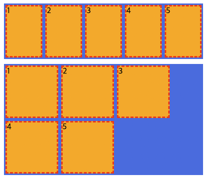
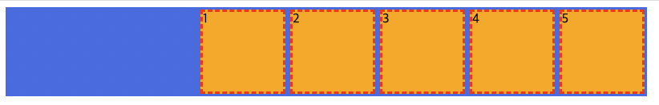
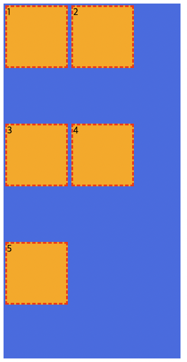
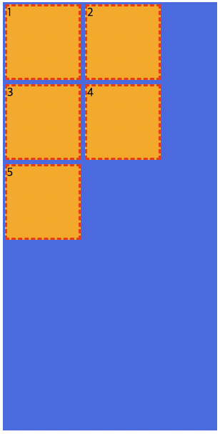
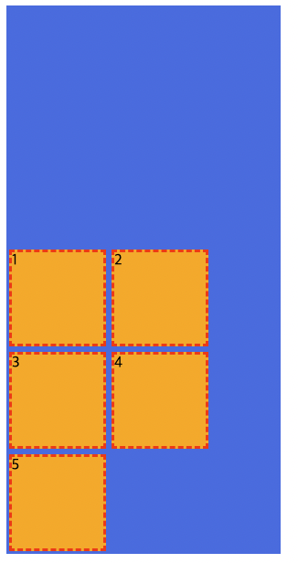
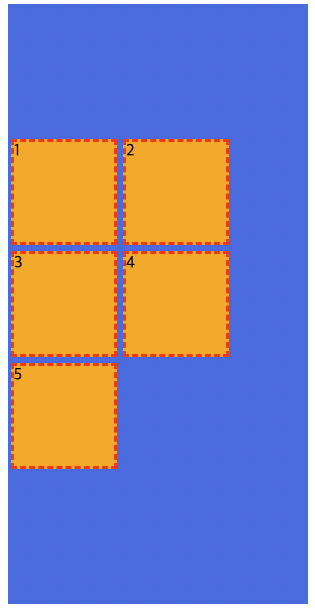

# flex

```css
 .container {
   display:flex;
 }
```
수평 정렬 됨
<br>
- Flex Container
  - display:flex 값이 들어 있는것
<br>
- Flex items
  - container의 자식 요소들

### 속성
Flex Container | Flex Items
:--:| :--:
display | <b>order
flex-flow | flex
<b>flex-direction | <b>flex-grown
<b>flex-wrap | <b> flex-shirink
<b>justify-content | <b>flex-basis
algn-content | align-self
<b>algn-items |

#### flex-wrap
flex-wrap | 속성
:--:| :--:
nowrap | 묶음(줄바꿈)없음
wrap | 여러 줄로 묶음

  <br>
flex item은 container너비에 맞게 줄어들려는 속성이있음
flex-wrap으로 한 줄에 표현할 수 있는 갯수만큼 넣고 줄 바꿈 해줄 수 있음

### justify-content 주축의(수평) 정렬 방법
justify-content | 속성
:--:|:--:
flex-start | flex items를 시작점으로 정렬
flex-end | flex items를 끝점으로 정렬
center | flex items를 가운데 정렬
space-between | 각 flex item 사이를 균등하게 정렬
space-around | 각 flex item의 외부 여백을 균등하게 정렬

justify-content: flex-end;<br>
컨테이너의 끝점으로 이동
 <br>

justify-content: center;<br>
컨테이너의 중앙으로 이동
 <br>

### align-content 교차축(수직) <b>여러줄</b> 정렬 방법
align-content | 속성
:--:|:--:
flex-start | flex items를 시작점으로 정렬
flex-end | flex items를 끝점으로 정렬
center | flex items를 가운데 정렬

align-content 없을때    align-content:flex-start<br> 

 <br>
align-content:flex-end <br>
<br>
align-content:flex-end <br>
